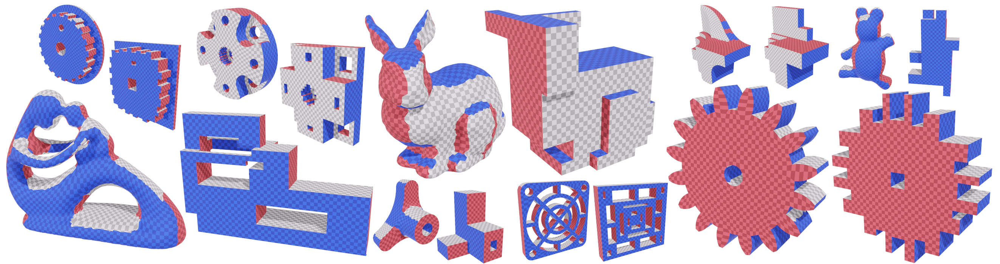

# Evocube: a Genetic Labeling Framework for Polycube-Maps

[Corentin Dumery](https://corentindumery.github.io),
[François Protais](https://www.linkedin.com/in/françois-protais-78b9ab13b/),
[Sébastien Mestrallet](https://sebastienmestrallet.fr/),
[Christophe Bourcier](https://www.researchgate.net/profile/Christophe-Bourcier),
[Franck Ledoux](https://www.linkedin.com/in/franck-ledoux-32b99646/)
<br/>
<br/>

Feel free to [reach out](https://corentindumery.github.io) if you have questions or suggestions :)



## Abstract
Polycube-maps are used as base-complexes in various fields of computational geometry, including the generation of regular all-hexahedral meshes free of internal singularities. However, the strict alignment constraints behind polycube-based methods
make their computation challenging for CAD models used in numerical simulation via Finite Element Method (FEM). We
propose a novel approach based on an evolutionary algorithm to robustly compute polycube-maps in this context.

We address the labeling problem, which aims to precompute polycube alignment by assigning one of the base axes to each
boundary face on the input. Previous research has described ways to initialize and improve a labeling via greedy local fixes.
However, such algorithms lack robustness and often converge to inaccurate solutions for complex geometries. Our proposed
framework alleviates this issue by embedding labeling operations in an evolutionary heuristic, defining fitness, crossover, and
mutations in the context of labeling optimization. We evaluate our method on a thousand smooth and CAD meshes, showing
Evocube converges to valid labelings on a wide range of shapes. The limitations of our method are also discussed thoroughly.


## BUILD

### Download
```
git clone https://github.com/LIHPC-Computational-Geometry/evocube.git
git submodule update --init --recursive
```

### Compile

```
mkdir build
cd build
cmake ..
make -j4 evolabel 
```


### Run
To compute a labeling on a triangle mesh and visualize it, simply run:
```
./evolabel path/to/boundary.obj
```

Paste for a quick test: `./evolabel ../data/moai.obj`

To go further, advanced tools used in our paper are showcased in `init_from_folder.cpp`.

### Test data

* [Mambo](https://gitlab.com/franck.ledoux/mambo)
* [OM Smooth & CAD](https://cims.nyu.edu/gcl/papers/2019-OctreeMeshing.zip)
* [ABC](https://deep-geometry.github.io/abc-dataset/)

### Useful repositories

* [Advanced polycube hex-meshing pipeline (our labelings can be used as input)](https://github.com/fprotais/robustPolycube)
* [Simpler hex-meshing pipeline with libHexEx](https://github.com/fprotais/polycube_withHexEx)
* [Tet mesh preprocessing](https://github.com/fprotais/preprocess_polycube)
 
## License
[GPL3](LICENSE) license
([FAQ](https://www.gnu.org/licenses/gpl-faq.html))

<!--
## Other functionalities

### Generate supplemental material

```
./init_from_folder
./supplemental_generator
in /supplemental, pdflatex supplemental.tex
```

### Prerequisites

Our repository requires only a few simple packages that can easily be installed. 

The following packages are required: 
```
pip3 install gmsh
```
-->

